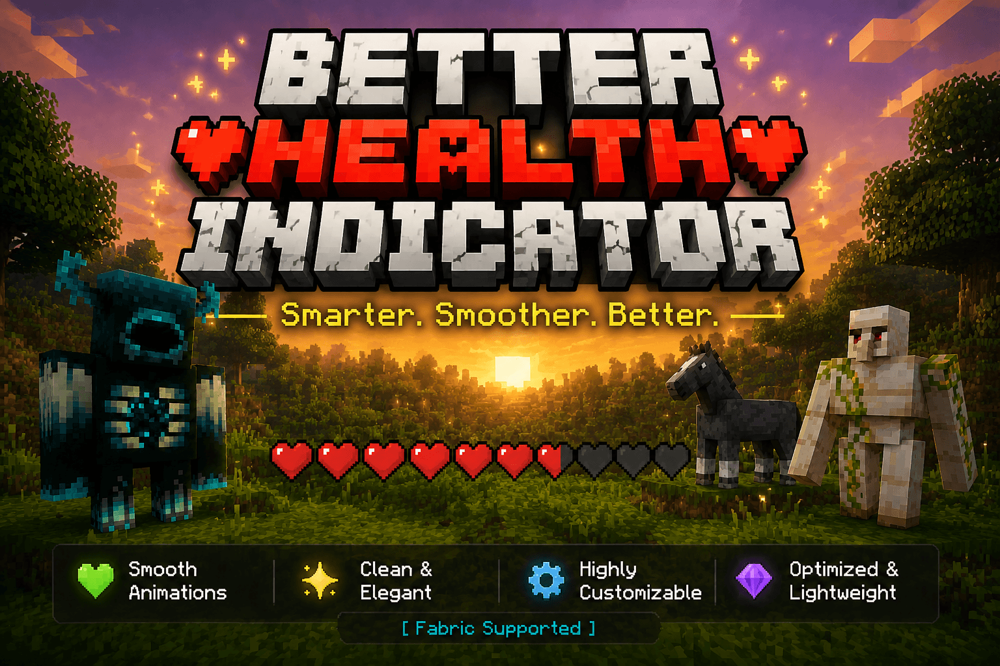
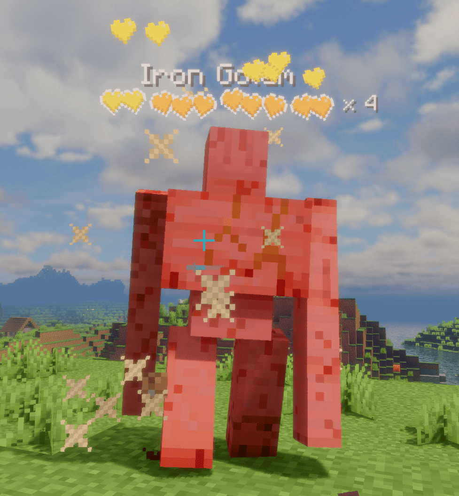
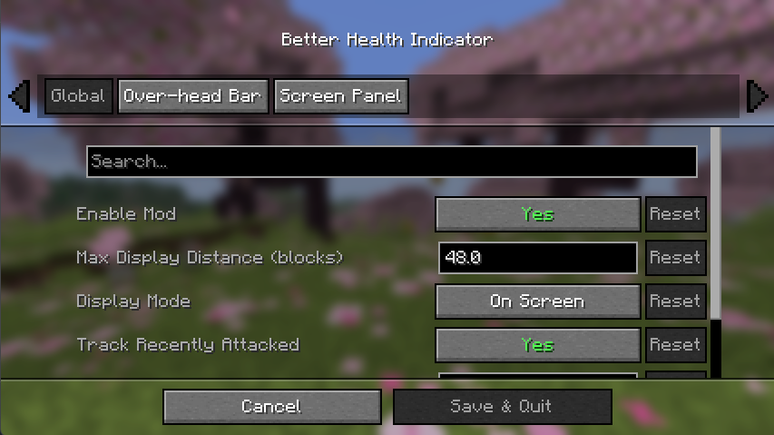

# Better Health Indicator

**Say goodbye to boring health bars — give every fight a beautiful, lively, and silky-smooth health feedback.**

&nbsp;

&nbsp;

&nbsp;

&nbsp;

[English](README.md) | [中文](README.zh-CN.md)

---

## 🎬 Demo

https://github.com/user-attachments/assets/dc8e73e8-1f7a-4f0c-8878-5751be728ebe

---

## 📖 What is it

**Better Health Indicator** is a **client-side** Fabric mod that replaces the plain vanilla health display with a beautiful, dynamic, smoothly animated one. It draws heart bars **above entities** and provides an informative target **panel in a screen corner**.

> 🟢 **Client-side only**: no need to install it on the server; it works for regular mobs and players on most servers.

---

## ✨ Features

### 🩸 Over-head health bars
- **Vanilla-style heart icons**, crisp and pretty above each entity.
- **Tiered multi-row hearts for high-HP mobs**: the bottom row is always vanilla red (the last row of powerful mobs becomes **hardcore hearts**), while upper rows are **tinted at runtime** from a grayscale template, with **every tier's color customizable**.
- **Dynamic "× N" multiplier**: mobs with lots of health show a color-coded multiplier by amount, updated live as they take damage.
- **Hit feedback**: on hit, dropping heart particles burst from the matching heart position (intensity scales with damage), hearts scatter + tilt, and the container outline blinks white — all toggleable.

- **Low-health tremor**: when health drops below a configurable threshold, the heart row trembles with staggered timing, recreating the vanilla near-death feel.
- **Death shatter**: heart containers chain-burst one by one when an entity dies.
- **Name & details**: optional name display (scale / bold adjustable); the health value or multiplier can sit to the right of the bar or after the name. Optionally **hides the vanilla floating name** to avoid duplication and overlap.

### 🖼️ Screen target panel
- Shows the target you are **looking at / recently attacked** in a screen corner.
- Displays a **live 3D model** (square or round frame), name, health (bar or hearts), and **potion-effect icons**.
- Supports **light / dark themes**, adjustable transparency, and auto-resizing width.

### 🎛️ Display & control
- Display modes: **On Screen** or **Looking At**, with attack tracking (a mob you just hit keeps showing for a while).
- Max distance, show self, show full-health entities, hide behind walls, and more are all configurable.
- Can hide vanilla damage heart particles to avoid visual conflict.

---

## 📦 Installation

1. Install [Fabric Loader](https://fabricmc.net/use/).
2. Download and drop into your `mods` folder:
   - This mod, **Better Health Indicator**
   - [Fabric API](https://modrinth.com/mod/fabric-api) — **Required**
   - [Fabric Language Kotlin](https://modrinth.com/mod/fabric-language-kotlin) — **Required**
3. *(Optional, highly recommended)* Install both of these to get an in-game graphical settings screen:
   - [Mod Menu](https://modrinth.com/mod/modmenu)
   - [Cloth Config](https://modrinth.com/mod/cloth-config)

**Requirements**: Minecraft **1.21.8 / 1.21.11** with Java **21+**, or Minecraft **26.1.2 / 26.2** with Java **25+**.

---

## ⚙️ Configuration

- With **Mod Menu + Cloth Config**: tweak every option visually via "Mods list → Better Health Indicator → Config".
- Without them: all settings still load from `config/better_health_indicator.json` and can be edited by hand.
- The settings screen is **fully localized** and follows your game language (Chinese / English).

---

## ❓ FAQ

**Q: Does the server need this mod?**
No, it's purely client-side.

**Q: Can I use it with performance / shader mods?**
Yes. This mod only handles health display and doesn't touch world logic.

---

## 🧩 Compatibility

- Loader: **Fabric**
- Versions: **Minecraft 1.21.8, 1.21.11, 26.1.2 and 26.2**
- Client-side only; does not affect saves or servers.

---

## 📜 License

This project is open-sourced under the **AGPL-3.0** license. See [LICENSE](LICENSE) for details.

## 🙌 Author

Made by **WJZ_P**. Feedback and suggestions are welcome!

 

## If you find it useful, please give it a ⭐ to show your support! ❤

## ⭐ Star History

