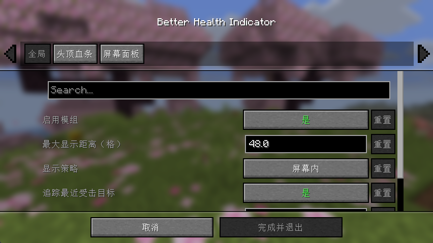

# Better Health Indicator

**告别单调血条，让每一次战斗都拥有精美、灵动、丝滑的血量反馈。**

&nbsp;

&nbsp;

&nbsp;

&nbsp;

[English](README.md) | [中文](README.zh-CN.md)

---

## 🎬 效果演示

https://github.com/user-attachments/assets/dc8e73e8-1f7a-4f0c-8878-5751be728ebe

---

## 📖 这是什么

**Better Health Indicator** 是一款**纯客户端** Fabric 模组，用精美、动态、带平滑动画的血量显示，取代原版朴素的血量呈现。它会在**生物头顶**绘制爱心血条，并在**屏幕角落**提供一个信息丰富的目标面板。

> 🟢 **仅客户端运行**：无需安装在服务器上，对普通生物与玩家在大多数服务器都能正常工作。

---

## ✨ 功能特性

### 🩸 头顶血条
- **原版风格爱心图标**，清晰漂亮地浮在生物头顶。
- **高血量生物多排分层爱心**：最底排始终是原版红心（强力怪物的最后一排会变为**极限模式硬核爱心**），上层血条由灰度模板**运行时染色**生成，**每一层颜色都可自定义**。
- **动态「× N」倍数**：血量很多的生物按数量分档着色显示倍数，掉血时实时更新。
- **受击反馈**：命中时从对应爱心位置迸出掉落爱心粒子（强度随伤害分档）、爱心散开 + 倾斜晃动、容器外圈闪白高亮——全部可开关。

- **残血颤抖**：血量低于可设阈值时，整排爱心错峰抖动，还原原版濒死手感。
- **死亡碎裂**：生物死亡时爱心容器逐颗连锁迸裂。
- **名字与详情**：可选显示名字（字号 / 加粗可调）；血量数值或倍数可贴在血条右侧或接在名字之后。可选**屏蔽原版浮空名字**，避免重复与遮挡。

### 🖼️ 屏幕目标面板
- 在屏幕角落显示你**正在注视 / 最近攻击**的目标。
- 展示**实时 3D 模型**（方形或圆形边框）、名字、血量（血条或爱心）以及**药水效果图标**。
- 支持**浅色 / 深色主题**、透明度调节、宽度自适应。

### 🎛️ 显示与控制
- 显示策略：**屏幕内** 或 **准星对准**，并支持受击追踪（刚打过的怪会继续显示一会儿）。
- 最大距离、是否显示自己、是否显示满血生物、被墙体遮挡时是否隐藏等都可调。
- 可隐藏原版掉血爱心粒子，避免视觉冲突。

---

## 📦 安装

1. 安装 [Fabric Loader](https://fabricmc.net/use/)。
2. 下载并放入 `mods` 文件夹：
   - 本模组 **Better Health Indicator**
   - [Fabric API](https://modrinth.com/mod/fabric-api) —— **必需**
   - [Fabric Language Kotlin](https://modrinth.com/mod/fabric-language-kotlin) —— **必需**
3. *（可选，强烈推荐）* 安装以下两者即可在游戏内打开图形化设置界面：
   - [Mod Menu](https://modrinth.com/mod/modmenu)
   - [Cloth Config](https://modrinth.com/mod/cloth-config)

**环境要求**：Minecraft **26.1**、Java **25+**。

---

## ⚙️ 配置

- 装了 **Mod Menu + Cloth Config**：在「模组列表 → Better Health Indicator → 设置」中即可可视化调整全部选项。
- 没装也没关系：所有配置仍会从 `config/better_health_indicator.json` 读取，可手动编辑。
- 设置界面已**完整本地化**，会跟随你的游戏语言显示中文 / 英文。

---

## ❓ 常见问题

**Q：服务器需要装这个模组吗？**
不需要，纯客户端即可使用。

**Q：可以和性能 / 光影模组一起用吗？**
可以，本模组只做血量显示，不改动世界逻辑。

---

## 🧩 兼容性

- 加载器：**Fabric**
- 版本：**Minecraft 26.1**
- 纯客户端，不影响存档与服务器。

---

## 📜 许可证

本项目基于 **AGPL-3.0** 许可证开源，详见 [LICENSE](LICENSE)。

## 🙌 作者

由 **WJZ_P** 制作喵。欢迎反馈与建议！

 

## 如果觉得好用，请给个 ⭐ 支持一下！❤

## ⭐ Star 趋势

